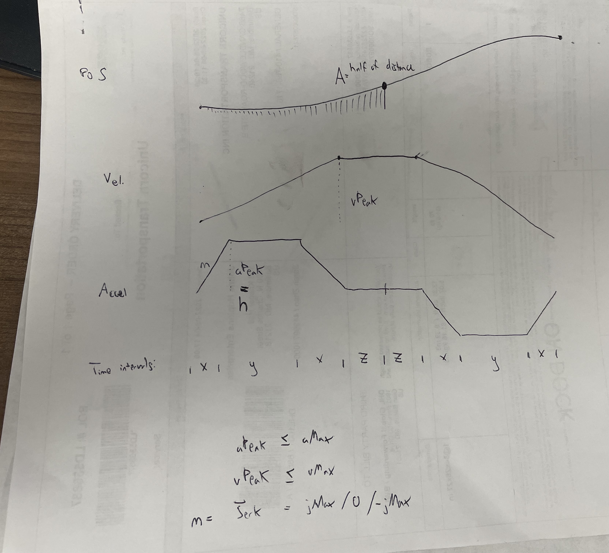

# Jerk constrained trapezoidal velocity profile.

Functions in this directory calculate the optimal trajectory given velocity, acceleration, and jerk constraints. It essentially makes a trapezoidal velocity profile, but slightly smoothed (jerk constraint not exceeded). It does this by assuming a trapezoidal acceleration profile and then solving for the correct peak velocity, peak acceleration, and timings of the different phases.

The typical use of these functions is having a robotic manipulator with N joints, each having a starting position s0, goal position s1, velocity constraint vMax, acceleration constraint aMax, and jerk constraint jMax. The function findMultipleJointProfiles takes in the starting and final positions, as well as constraints. The findOptimalProfile finds the fastest profile for each of these joints. Taking the slowest joint (i.e. slowest profile) as the required time T, the function findOptimalProfileWithTimeConstraint will then find the optimal profile that takes the full amount of time. In this way, all joints start and finish at the same time.

These are analytical solutions, mostly based on the relationship between the sides of a trapezoid (i.e. acceleration curve) and its double integral (position = area under velocity curve).

Brief explanation of the variables in this directory. For a trapezoidal acceleration profile:

x=length of acceleration rise
y=length of time at peak acceleration
z=half of length of time at zero acceleration
m=max jerk (slope of accleration during rise phase)
h=peak acceleration (<= aMax)
T=x+y+x+z (note this is time to cover HALF of the full distance)

